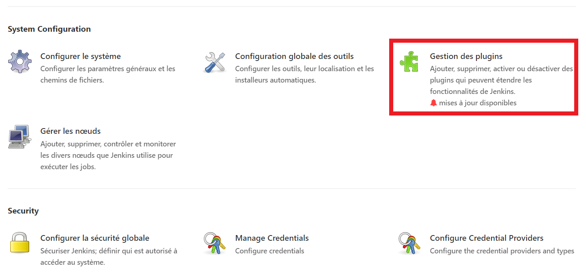
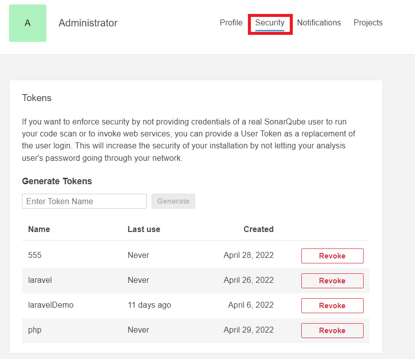
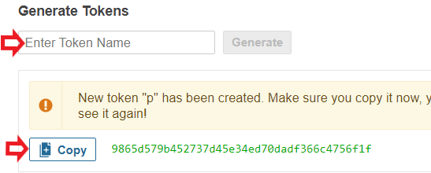
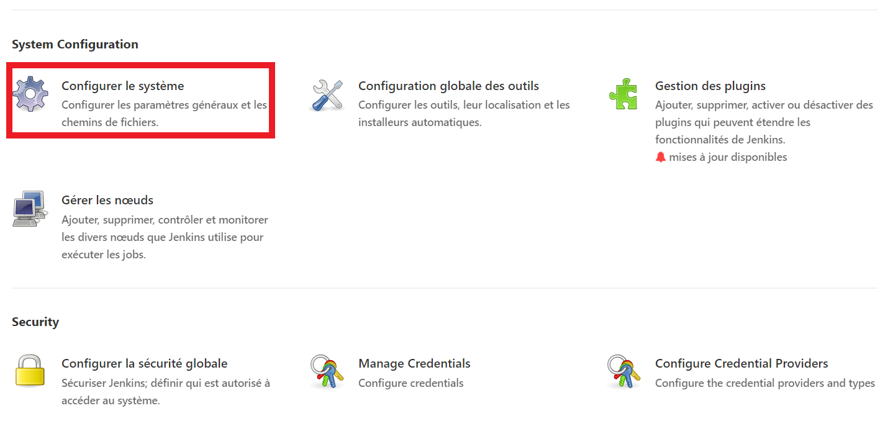
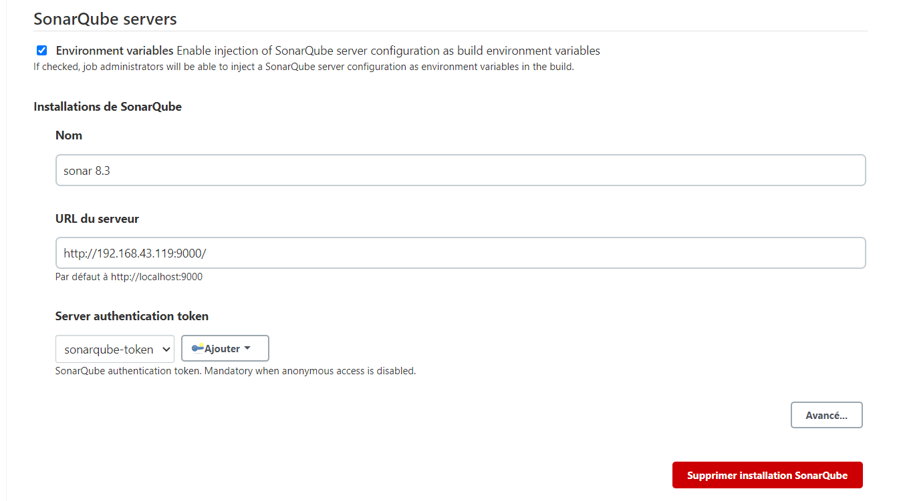
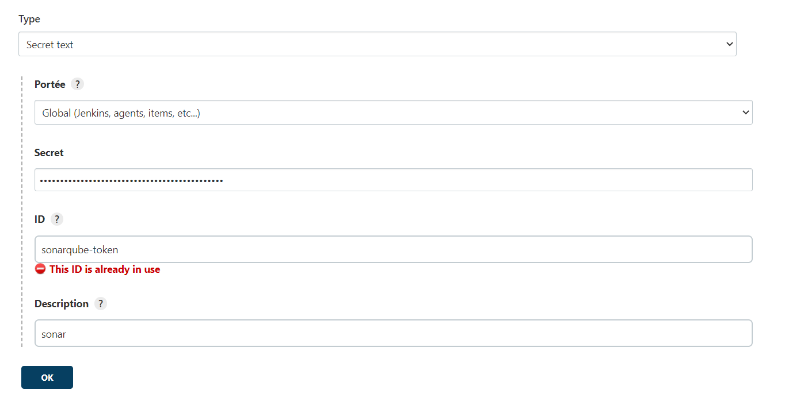
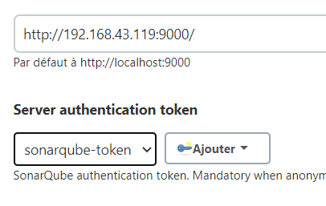
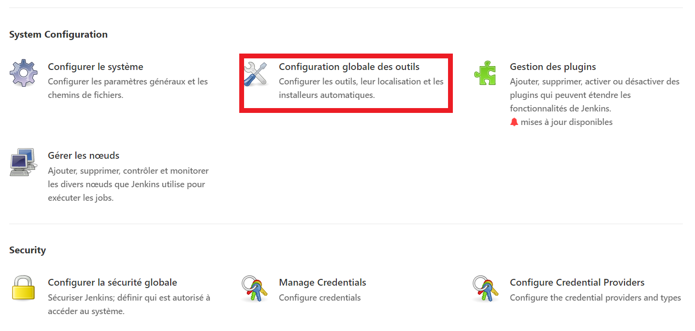
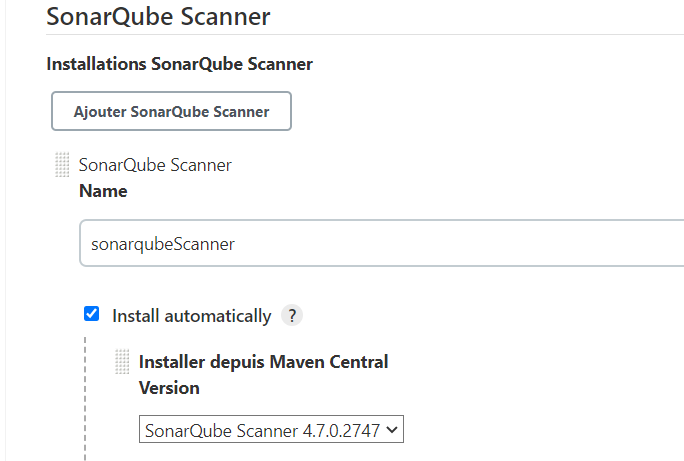
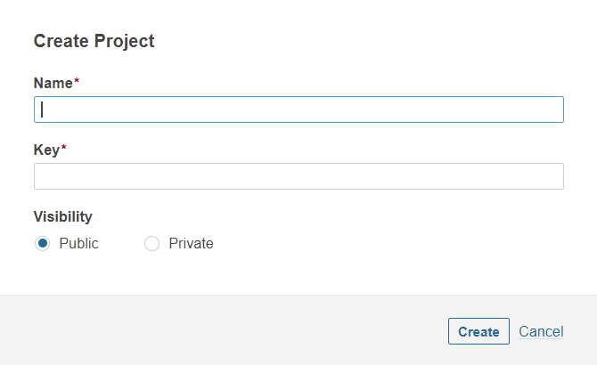

# Integrate sonarqube with Jenkins

## **What is SonarQube?**

SonarQube is an open-source platform, which is used for continuous
analysis of source code quality by performing analysis on your code to
detect duplications, bugs, security vulnerabilities and code smells on
programming languages.

## **What is Jenkins?**

Jenkins is an open-source automation tool is created using Java
programming language. For the initial setup, it facilitates users with
CI/CD (continuous integration (CI) or continuous delivery) technique
that simplifies the use and management of processes.

## **How to integrate SonarQube with Jenkins**

I would say that SonarQube one of the engine which helps to increase
project quality and prevent future unpredictable issues when your
project grows.

### **Step 1: Install SonarQube Scanner Plugin**

In order for Jenkins to communicate with SonarQube, we need special
plugins to make it happen. Simply login to Jenkins and proceed to
install tools that will allow us to connect and communicate with
SonarQube. Luckily, there is a plugin ready for us to install and
configure. Head over to our Jenkins Server ,

click on "Manage Jenkins" \> "Manage Plugins" \> Click on the "Available
tab" then search for SonarQube. The screenshots for the above steps are
shared below.




Select "SonarQube Scanner" once it shows up in the list of plugins.
Click on "Install without restart" tab then wait for it to complete
installing.


### **Step 2: Generate Token in SonarQube Server**

In this step we are going to generate a token that we will use in
Jenkins server to connect to it. We already covered the installation of
SonarQube Server so head over to our installed instance, login as
Administrator and do the following:

Click on your Admin account Icon which will bring up a drop down menu.
Click on "My Account".


That will open a new page. On the new page, click on the "Security" tab.



A new "Tokens" area will appear. Under "Generate Tokens", put a name you
like then hit "Generate".



### **Step 3: Configure SonarQube in Jenkins**

While still logged into Jenkins as an administrator go to "Manage
Jenkins" \> "Configure System".




Scroll down to the SonarQube configuration section, click Add SonarQube,
and add the values you will be prompted to provide.

These include a name you prefer, SonarQube server URL, that is where
your SonarQube server is running at then the "Server authentication
token". For the Server authentication token, click on "Add" then
"Jenkins"



That will open up the Jenkins Credentials Provider. Leave the domain as
it is, and choose "Secret Text" for Kind as shown below. Once that is
done, enter the token we created in Step 2 for "Secret", give it a
Name/ID that will match with what the secret is all about, you can add a
description if you like then hit "OK"



After that is done, scroll through "Server authentication token" and
choose the token we have just added. Once that is done, simply hit
"Apply" then "Save".



### **Step 4: Configure SonarQube Scanner**

In order for our code to be scanned by SonarQube, we need to configure
SonarQube scanner. To do this, head over to "Manage Jenkins" then click
on "Global configuration Tool".




Scroll down and look for "SonarQube Scanner". Click on "Add SonarQube
Scanner" tab so that we can add it here. Since we already have a working
instance of SonarQube, uncheck "Install Automatically" and then beside
"SONAR_RUNNER_HOME" environment variable, enter the path where SonarQube
is installed in your serverAfter that, hit "Apply" then "Save".



### **Step 5: Create a Project in SonarQube**

Head over to your SonarQube Server, log in as Administrator and create a
project by following the following steps. Click on "Administration" \>
"Projects". Click on the "Projects" drop down list and click on
"Management". On your far right, close to the top, you will see a tab
called "Create Project".

![C:\\Users\\user\\Desktop\\capture\\iii.PNG]
Click on it and it will bring a form where you will enter the details of
your project that is its name and key. You can key in any value here as
you prefer then click on "Create".



### **Step 6: run a test**


To finish we need to run these scripts :


````
stage(\"sonarqube\") {

withSonarQubeEnv(installationName: \'sonar 8.3\', credentialsId:
\'sonarqube-token\') {

sh
\"\"\"/var/lib/jenkins/workspace/mypipe/sonar-scanner-4.7.0.2747-linux/bin/sonar-
scanner \\

-Dsonar.projectKey=kkk \\

-Dsonar.sources=. \\

-Dsonar.host.url=http://192.168.43.119:9000/ 

}
}
